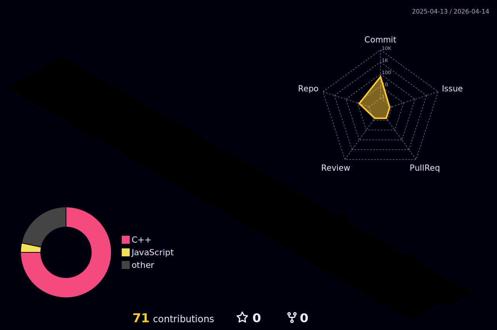

<!-- 💫 PLANTILLA README PROFESIONAL (versión Devicon + SimpleIcons) -->
<!-- Diseñada por María Cebriá (@mariacebria) -->
<!-- Instrucciones:
1️⃣ Sustituye los textos “Lorem ipsum” y los enlaces por tu información.
2️⃣ Elimina los iconos que no uses o añade nuevos desde https://devicon.dev o https://simpleicons.org
3️⃣ Mantén la estructura si quieres conservar el diseño y formato PRO.
-->

  <!-- 🧠 Encabezado animado con efecto typewriting -->
  <h1 align="center">
    
  </h1>

  <h3 align="center">
    GIIROB · @UPV 🎓
  </h3>

  <!-- Divider visual -->
  

## 👩‍💻 Quién soy
Me llamo María Cebriá, y soy una apasionada de la tecnología, el diseño y la innovación.  
Actualmente estudio en la **Universitat Politécnica de Valencia**, el grado de **Informática Industrial y Robótica**.  
Me encanta el _diseño web_ y sobre todo compartir con los demás lo que aprendo.

## ⚙️ Qué hago
- Me encanta programar con **C++**.  
- Diseño webs con **React y Tailwind**.  
- Suelo quemar transistores con mi **Arduino :)** .  

## 🌍 Qué busco aportar al Mundo
Mi propósito es construir tecnología que **deje huella**.  
Busco aprender, enseñar y crear herramientas que simplifiquen la vida de las personas.  Quisiera devolverle al Mundo todo lo que me enseña a mí.

## 🧠 Lenguajes y Tecnologías
<h1 align="center">
    
  </h1>

<!-- 💡 Consejo: usa iconos de https://devicon.dev (para lenguajes) o https://simpleicons.org (para marcas). -->
<!-- Puedes ajustar el tamaño con width="40" o el color con /COLORHEX al final del enlace. -->

### 🎨 Frontend

  
  
  
  
  
  
  
  
          

### ⚙️ ¿Backend?

  
  
  

### 🎨 Diseño y UI/UX

  
          
  

### ⚡ Automatización, DevOps y Hardware

  
  
  
 
  

<!-- Incluso si quieres hacerte el guay xd-->

### 🏠 Mis sistemas operativos fav
<!-- Escoge el tuyo-->

          
<!-- Editores de codigo-->    
### 📒 Editores de código  

                 

## 📦 Repositorios Destacados
| Repositorio | Descripción | Tecnologías |
|---|---|---|
| 🧠 [Mi Portafolio](https://mariacebria.com) | Web personal con animaciones y secciones dinámicas. | React · Next.js · Tailwind |
| 🤖 [Plantillas Web Clínicas](https://github.com/MariaCebriaF/web-clinica-template) | Mi primer proyecto web público. | React · Tailwind |
| 🦆 [Canal de Youtube](https://www.youtube.com/@MariaCebriaF) | Contenido educativo de programación y proyectos. | YouTube · Notion · OBS |

## 🧩 Me gustan los retos
<!-- Sustituye los enlaces por tus perfiles -->

  
  

## ☕ Conecta conmigo

  
  
  

  

  

